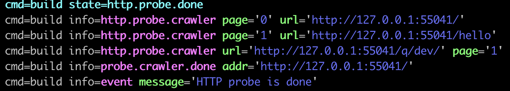

= Docker Slim Lab

'Docker slim is a dev tool that allows you to lint Dockerfiles, analyse images and optimize them.

Installation procedure: https://github.com/docker-slim/docker-slim#installation  

== Lab 01: Generate your image

. *With the provided sample project, run `mvn package` to build the maven project*
. *Create your docker image whith the following command* `docker build -f src/main/docker/Dockerfile.jvm -t cnd-docker-slim .`
. *Take a look at the generated image size using* `docker image ls`
. *Run the application using* `docker run -p 8080:8080 --rm -it cnd-docker-slim`. You can test the application with the following commands:
    - curl -s -f "http://localhost:8080/hello"
    - curl -s -f -d name=John -d name=Doe "http://localhost:8080/hello/say"

== Lab 02: Minimize your docker image

. *Using `docker-slim` provided binary minify the docker image using:*
`docker-slim  build --http-probe-ports 8080 --http-probe cnd-docker-slim`

[NOTE]
====
docker-slim automatically detect your endpoints :

====

== Lab 03: Remove an endpoint

. *Go to the `index.html` and remove the line `<a href="/q/dev/" class="cta-button">Visit the Dev UI</a>`*
. *Generate your application and docker image*
. *Rerun docker-slim*

NOTE: The `/q/dev` endpoint should be deleted as `docker-slim` should not have found it

== Lab 04: What about that missing endpoint

If you looked at the `GreetingResource.java`, you can see that there are two endpoints but one of them is not detected.

. *Analyse the file provided `probe-commands.json`*
. *rerun your analysys with the command file using*
`docker-slim  build --http-probe-ports 8080 --http-probe cnd-docker-slim --http-probe-cmd-file probe-commands.json`
